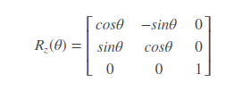
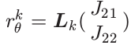

Simultaneous calibration of odometry and sensor parameters for mobile robots

[toc]


## 1. 问题描述：

   机器人坐标系看作odom坐标系， 传感器坐标系是激光坐标系  。 

    

   物理量表示含义

​      


## 2. 外参标定描述：

   标定参数为左右轮半径 $r_l$ $r_r$ ，轮间距$b$， 和激光相对轮子的外参（x,y,yaw）

   输入： 左右轮转度（rad/s）      激光里程计数据

   输出： 标定参数 

###  2.1 运动模型： 左右轮线速度转化为基体的线速度与角速度


​										其中， 	　

### 2.2 SE２ 计算公式：

​	　　 

​	SE2坐标变换的关系



​				 


### 2.3  优化方程


### 2.4 求解方法：

3种通用求解方案： 

​	1）基于模型的控制理论：连续时间


​	2） 静态分析：
​	y离散可观， 确定性的的输入x， 加上足够的约束一起去求解X.


​	3) 统计分析：Fisher Information Matrix (FIM)： 线性系统
 	u选择适当的情况下如果FIM中X是满秩的，系统可观


==》 本校正系统选用方法二的静态分析（离散的，非线性系统）

前提约束条件：

​	1) 全局参数变量的二义性：  ==》 b>0 来区分


​	2） 标定参数可观的条件：  **左右轮独立**， **机器人观察区间内移动需要有旋转**


​	3）轨迹速度与轮子转速： 线性独立关系


## 3. 标定系统问题


非凸优化问题 ==》  通常的数值优化问题并不能有效解决。==》 closed form

本标定算法是建立在大前提假设：


补充： 假设一不成立就得考虑 ==》covariance inflation 

 ==》 旋转和平移的相互独立性，不相关。==》   =》 系统分解为线性部分和非线性部分

### 3.1  线性估计 $J_{21}$  $J_{22}$： 旋转的一致和可观性


$\hat s_{\theta}^{k} ==  s_{\theta}^{k} $   ,且与  $J_{21}$  $J_{22} $ 线性相关



其中，

==>  线性系统 =》 最新二乘问题  连续系统离散化处理  ==》估计 得到参数 $\hat J_{21}$  $ \hat J_{22} $   也就是$-r_L/b , r_R/b$


### 3.2 非线性估计其他参数 $b,L_x,L_y, L_{\theta}$   

参差项转化：（不同坐标系下参差表示）


优化问题转化为：


问题求解：分解


​	


1）里程计运动平移部分的表示为：


​			其中， 


**平移运动简化为：** 

​		其中：


​		公式18,19中的 $r_{\theta}^k$  参考公式13的离散化

​	2） 系统转化为二次型系统问题：
​		参数：


​		转移矩阵： 

​									

​	原优化问题等价的矩阵表示为：，其中

   **极大似然问题转化为二次型问题 表示为：**


具体推到表示如下：


  


			


3） 带约束的最小二乘问题：


​							


​					对应存在$\lambda $ 使得$M+ \lambda W $为奇异矩阵， 即
​										

​					其中


​					（a）可得到关于$\lambda$的二阶项，项系数为： 
​						求得系数 $\lambda^{(1)} \lambda^{(2)}  $

​					

​			(b) 求解参数$\varphi ^{(i)}$

​			$\gamma ^{(i)}$ 是$M + λ^{(i) }W$ 核的非零向量， 也就是$M + λ^{(i) }W = 0 $的通解。  同时依据公式24的约束归一化求得$\varphi ^{(i)}$ ：
​									

​			（c）通过具体的约束关系 公式25，从$\varphi ^{(1)}$ $\varphi ^{(2)}$ 找到正确的 $\hat \varphi $ 

​         4） 系统参数的解
​									

## 4 异常剔除

 轮子打滑， 传感器平移估计出错, 以及数据同步异常等原因，需要剔除异常值

利用估计的模型参数计算里程计增量在传感器坐标系下的表示，比较其与传感器计算的观测增量，偏差比较大则为异常值，要剔除。

 


## 5. 不确定性分析： 协方差估计


## 6. 离散化 常速度简化形式


Bounding the Approximation Error 区间常速度的限制：


## 7. 实验参考

### 7.1 数据量越多越好

### 7.2 小环境测量更佳

```
With minimal tuning of the maximum velocities and the interval length, one can make the robot stay in a small region.
```

### 7.3 分段输入

### 7.4  相对低速运动： 低速且不要很低

```
Choose commands that lead to relatively low speeds. This minimizes the possibility of slipping and ensures that the sensor data are not perturbed by the robot motion. However, do not choose speeds so low that the nonlinear effects of the dynamics become relevant, especially if using the constant speed assumption (usually robots with DC motors are commanded in velocities via voltage, but the platform does not attain constant velocity instantaneously).

```

### 7.5 时间区间T的选择

T太短，标定会过于敏感，T越长关于参数的信息会越丰富；但T不能过长，不然激光计算的数据的相关性会降低（匹配精度会损失）

作者实验条件参考：Ｔ＝0.8s　　ｗ_max=　0.5 rad/s
==》  T内平移 1 cm   旋转 20°  

laser：５ＨＺ　取4帧

 ```
In our setting, we first chose the maximum wheel speed to be 0.5 rad/s (30 ◦ /s),
which made sure that the robot does not slip on the particular terrain. We recorded range-finder readings at 5 Hz as well as dense odometry readings (at 100 Hz). Then, we used only one in four range readings, which corresponds to choosing an interval of T  0.8 s, such that the robot travels approximately 1 cm (in translation) and 20 ◦ (in rotation) per interval.
 ```

四组运动实验：直线运动， 纯旋转， 朝左右运动


github代码daima建议：

建议你采集一小段距离（ 运动 1 分钟 左右）就可以了，距离越长，outlier 越多，需要调整参数，才能有好的标定结果。标定路径不需要闭环，简单跑一下弯曲的轨迹就行，迭代次数可以修改，论文中采用过 4-8之间，效果差不多。


补充： 拉格朗日乘子方法求解带约束的优化问题 [如何理解拉格朗日乘子法？](https://www.zhihu.com/question/38586401)
		


## 8. 算法伪代码


## 9. 参考

论文： As paper [Simultaneous Calibration of Odometry and Sensor Parameters for Mobile Robots](https://www.researchgate.net/publication/260634803_Simultaneous_Calibration_of_Odometry_and_Sensor_Parameters_for_Mobile_Robots)

论文对应代码:  https://github.com/AndreaCensi/calibration

中文参考博客：[2d Laser 和 Odomter 内外参数标定工具原理及使用方法](https://blog.csdn.net/heyijia0327/article/details/88571176)

中文参考博客对应代码：https://github.com/MegviiRobot/OdomLaserCalibraTool


## 10 ys_astrid 实验数据


|                     | 1          | 2          | 3           | 4          | aver   | ref-measure |
| ------------------- | ---------- | ---------- | ----------- | ---------- | ------ | ----------- |
| Axle between wheels | 0.602922   | 0.538422   | 0.549336    | 0.546807   | 0.5449 | 0.53575     |
| LiDAR-odom x        | 0.119317   | 0.123547   | 0.139148    | 0.138092   | 0.1336 | 0.14        |
| LiDAR-odom y        | 0.0435663  | 0.00500196 | 0.00582043  | 0.0092771  | 0.0067 | 0.0         |
| LiDAR-odom yaw      | 0.00382949 | 0.00594876 | 0.000741958 | 0.00450296 | 0.0037 | 0.0         |
| Left wheel radius   | 0.083863   | 0.0834078  | 0.0841896   | 0.0837314  | 0.0838 | 0.0845      |
| Right wheel radius  | 0.0871739  | 0.0834341  | 0.0838561   | 0.0834509  | 0.0836 | 0.0845      |
| 数据是否可靠        | N          | y          | y           | y          |        |             |